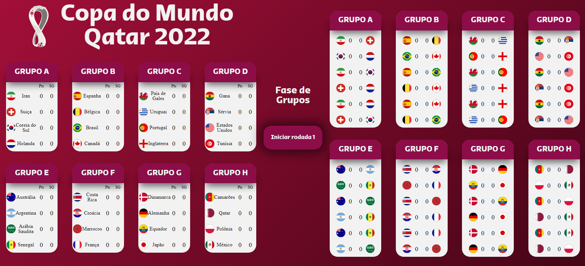
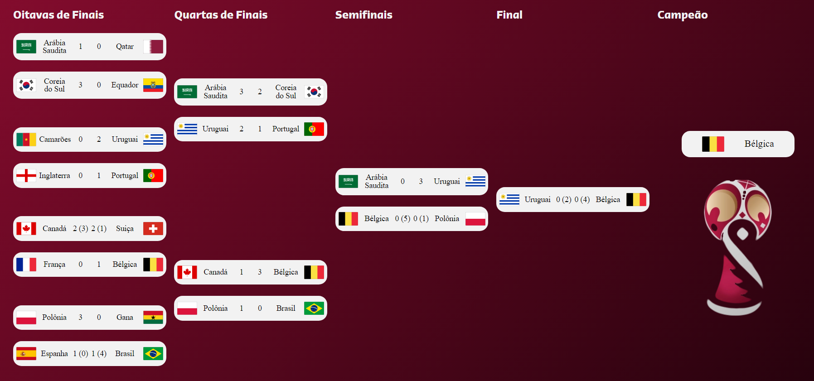
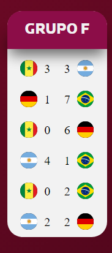
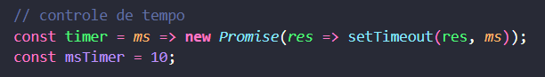

# Processo seletivo da vaga de estágio como desenvolvedor da Geopost Energy  - 2022  

O projeto está divido em três branchs: main, mvp e newFront.  
- A branch mvp foi a primeira parte do projeto, onde apenas desenvolvi a lógica e utilizei um front básico para mostrar os valores na tela.
- A branch newFront foi a segunda já implementando a lógica em um front mais trabalhado.  
  
## Projeto  
O projeto está divido em 4 pastas:  
- css: responsável pelos estilos utilizados;  
- img: responsável pelas imagens presente no site;  
- js: lógica em javascript das funcionalidades;  
- readmeImagens: imagens que serão utilizadas nesse README.  

O projeto é composto por uma tela dividida em duas partes: fase de grupos e fas de eliminatórias.  

A primeira parte é a parte da fase de grupos onde as seleções se enfrentam em 3 rodadas com 2 jogos cada. No final, cada seleção terá enfrentado
uma vez cada uma das outras seleções de seu grupo.  

  

A segunda fase é a fase de eliminatórias, onde as equipes irão se enfrentar em um mata mata. Os empates nessa fase são decididos com disputa de 
pênaltis (valores entre parênteses).  

  

Quanto aos pênaltis foram implmentados as funções de continuar ocorrendo pênalti até que os times terminem com uma diferença de 1 ponto e terminar
antes do final caso não seja mais possível para uma equipe ganhar.

   

Além disso como forma de brincadeira, foi inserido um easter egg caso o Brasil enfrente a Alemanha em algum momento.

  

## Velocidade dos resultados
Cada resultado está ocorrendo a cada 2 segundos, porém é possível modificar a velocidade alterando a variável msTimer no arquivo: ./js/variables.js.

  

## O que pode ser melhorado
Não foi implementado a parte de responsivo, por isso é possível que em resoluções menores que 1440x900 fique um pouco apertado as informações na tela.  
Para caber o máximo possível em uma tela apenas, preferi implementar tudo em uma página só.  
A segunda parte ocorre tudo de uma vez sem botão coordenando porque eu achei que ficaria meio esquisito colocar um botão na parte das eliminatórias.  

Obs.: Informações mas específicas do código estão incluidas como comentários no mesmo.
